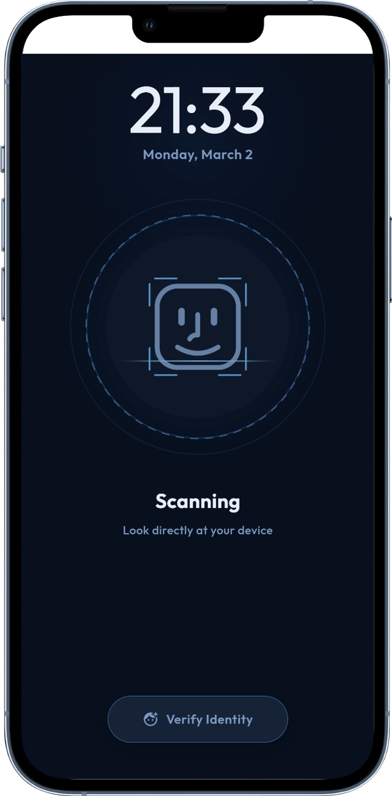

# FaceID Verification - Flutter

A premium FaceID verification screen built with Flutter, featuring smooth animations, custom painters, and modern geometric typography.

## Features
- **Dynamic FaceID Icon**: Custom-drawn animated face with realistic eye motion.
- **Premium Typography**: Uses the **Outfit** Google Font with a bold typographic hierarchy.
- **Responsive Design**: Automatically scales UI elements for all mobile aspect ratios.
- **Visual Feedback**: Real-time scanning lines, pulsing rings, and success animations.
- **Dark Mode Aesthetic**: Deep blue glassmorphism design for a professional look.

## Screenshots

<p align="center">
  
  
</p>

## Getting Started

### Prerequisites
- Flutter SDK
- Dart SDK

### Installation
1. Clone the repository:
   ```bash
   git clone [repository-url]
   ```
2. Navigate to the project directory:
   ```bash
   cd FaceID-Verification
   ```
3. Install dependencies:
   ```bash
   flutter pub get
   ```
4. Run the application:
   ```bash
   flutter run
   ```

## License
This project is open-source and available under the MIT License.
